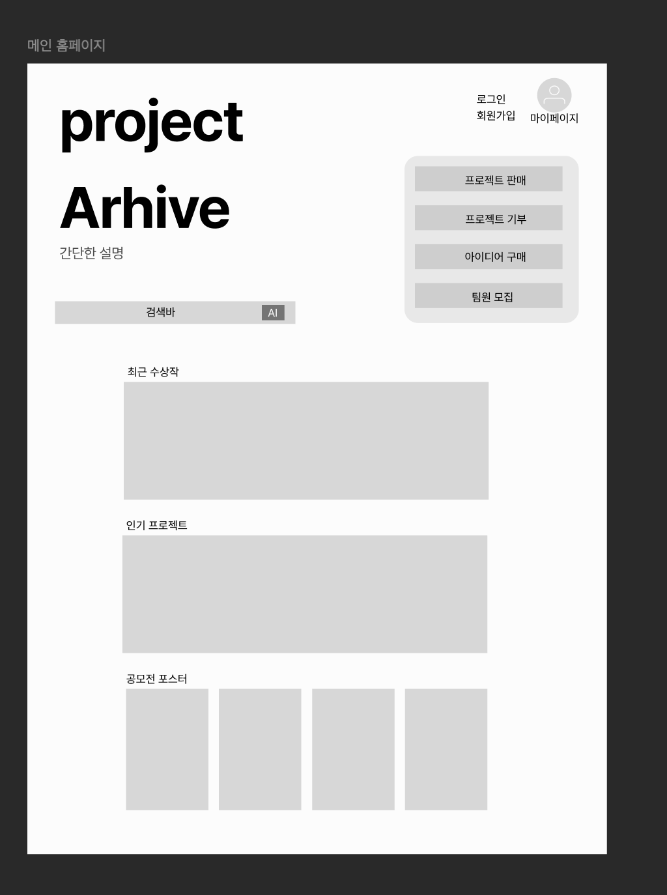
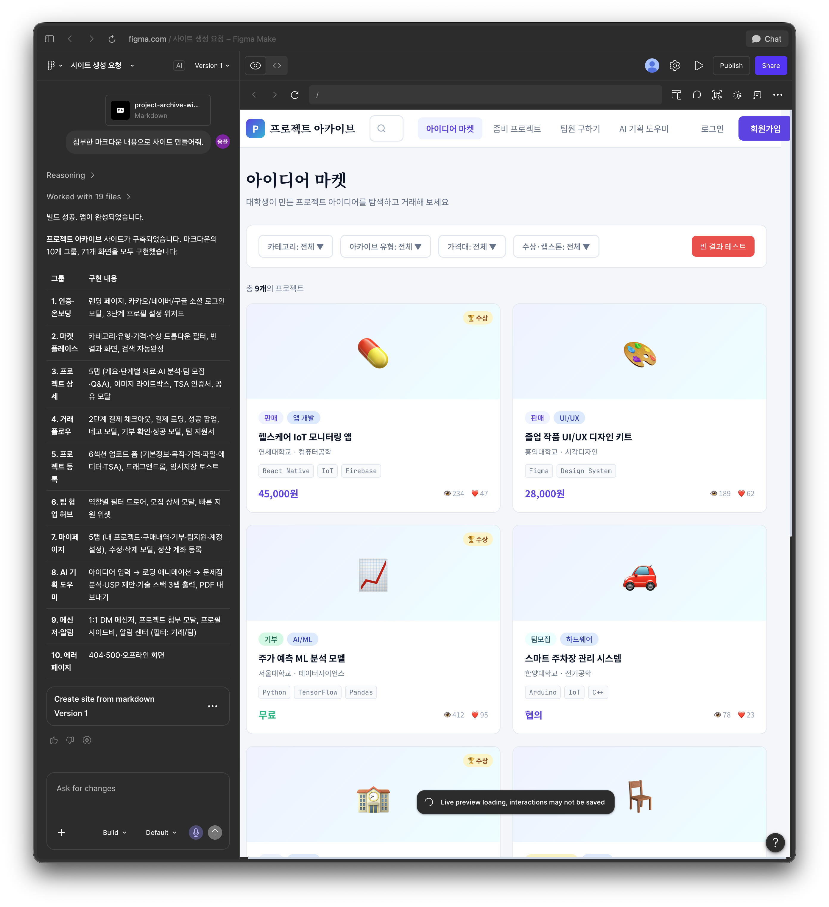
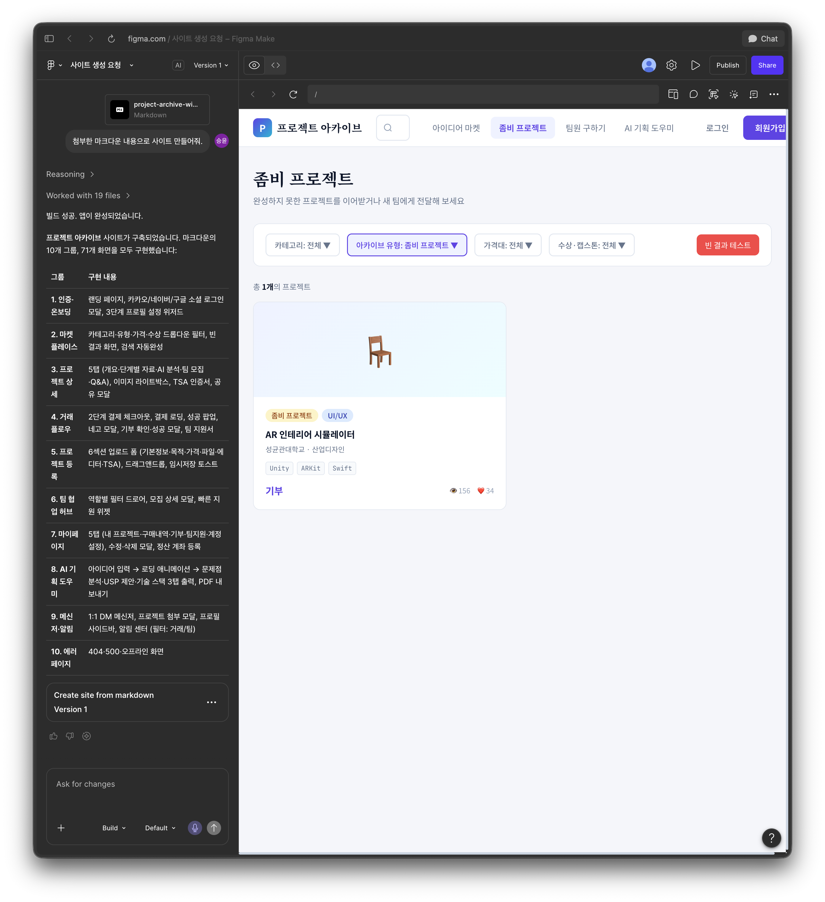
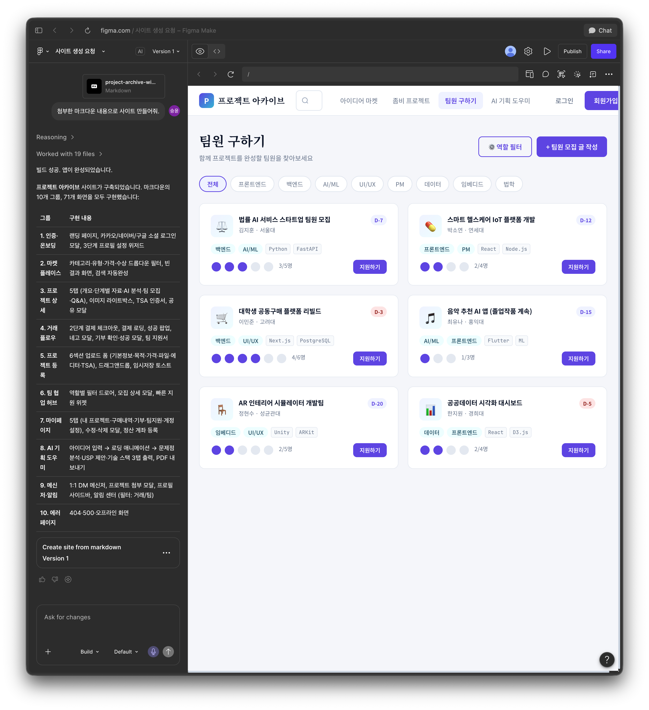
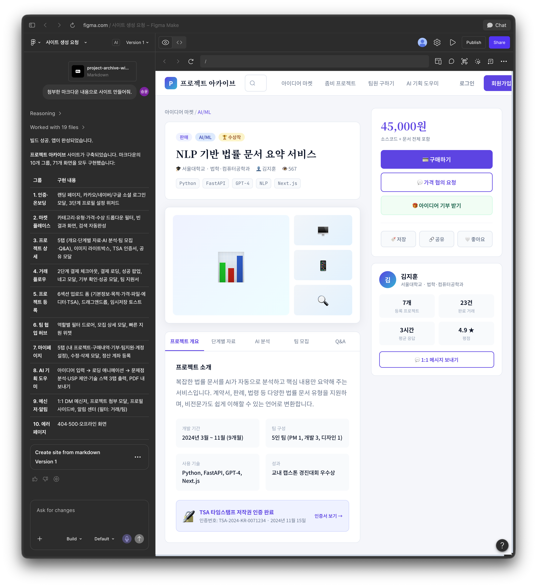
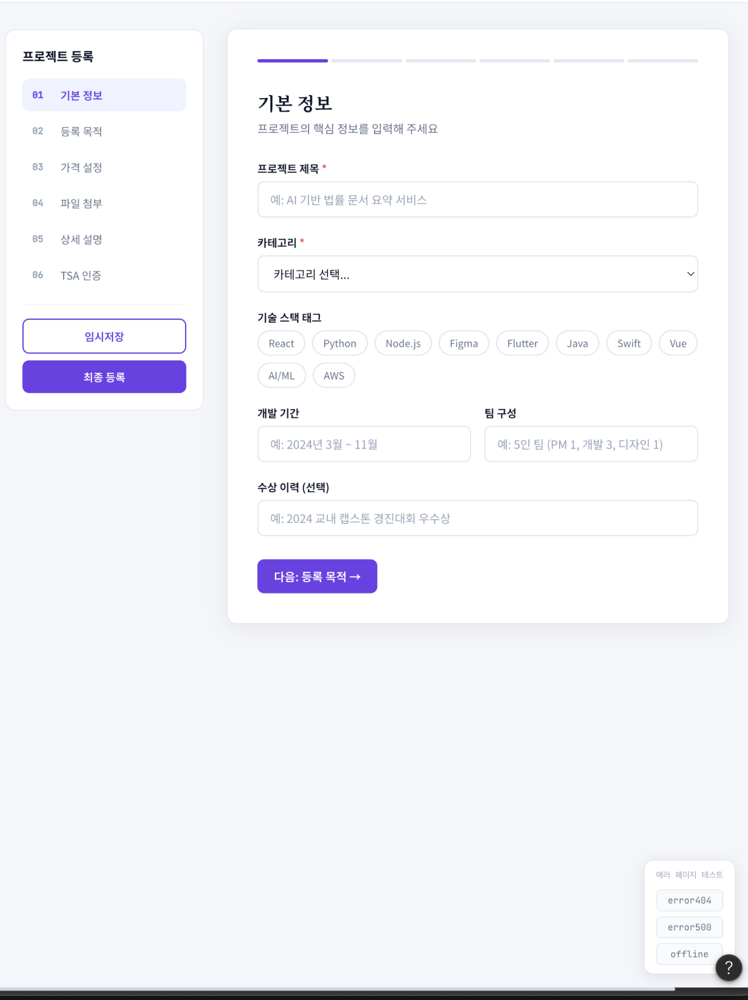
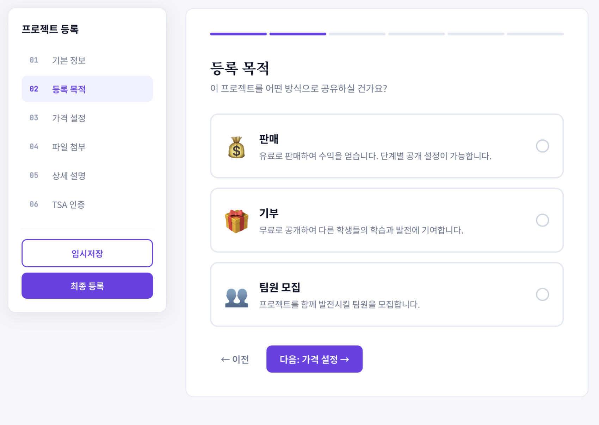
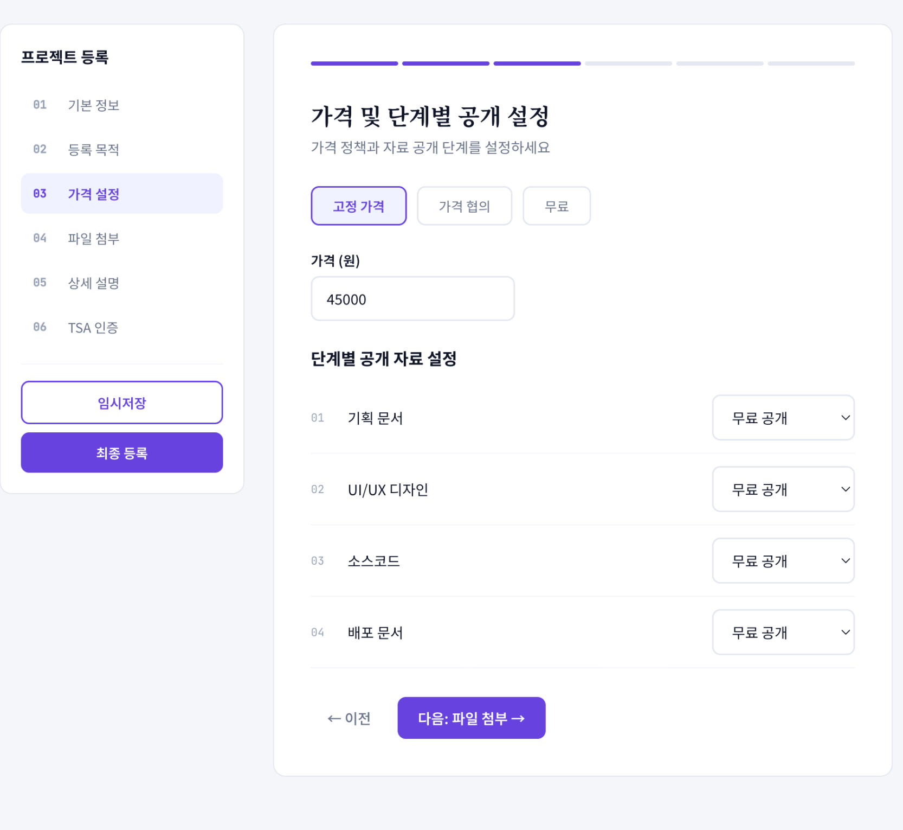
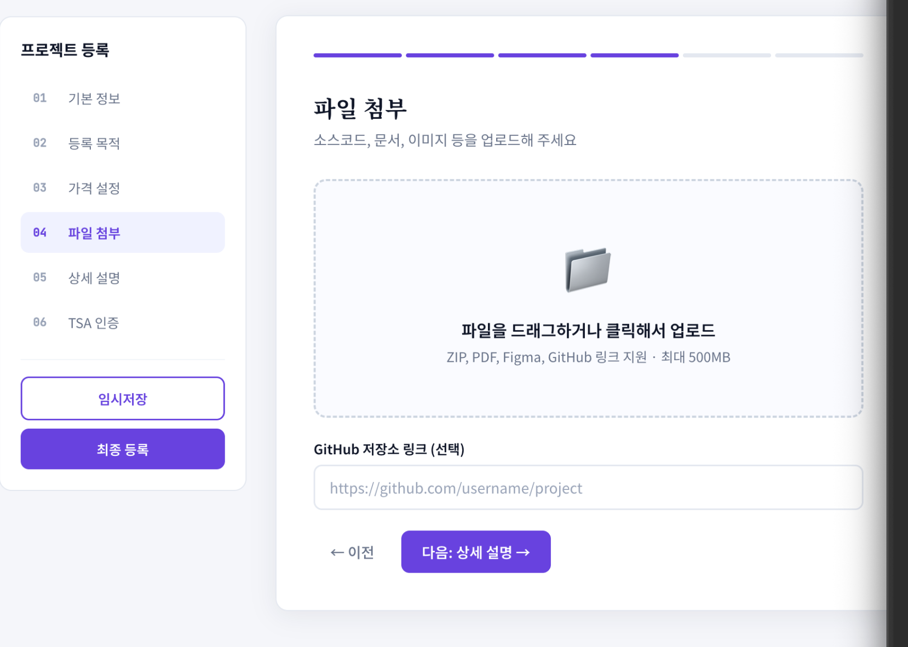
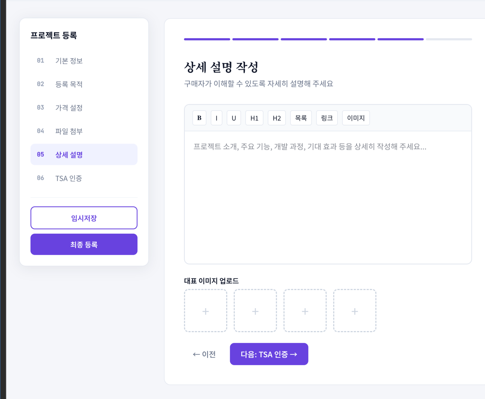

# 초기 와이어프레임 참고 자료

> 문서 상태: 아이디어 탐색 단계
>
> 현재 확정된 디자인은 없다. 이 문서와 이미지는 제품의 대략적인 정보 구조와 기능 아이디어를
> 공유하기 위한 와이어프레임이며, 시각 디자인 명세가 아니다.

## 사용 원칙

- 이미지의 색상, 폰트, 간격, 카드 형태와 아이콘을 그대로 복제하지 않는다.
- Figma Make가 생성한 더미 데이터와 문구는 확정된 요구사항으로 취급하지 않는다.
- 캡처에 포함된 Figma 채팅 영역, 브라우저 프레임과 로딩 UI는 제품 화면이 아니다.
- 화면에 등장한 메뉴명과 기능도 기획 과정에서 변경될 수 있다.
- 구현할 때는 `docs/product-context.md`의 문제 정의와 핵심 가치 흐름을 우선한다.
- 접근성, 반응형 레이아웃과 실제 디자인 시스템은 별도로 설계한다.

## 홈 화면 구상

현재 담긴 아이디어:

- 서비스 소개와 통합 검색을 첫 진입점으로 제공
- 프로젝트 판매·기부·구매·팀원 모집 등 주요 행동으로 이동
- 최근 수상작, 인기 프로젝트와 공모전 정보 노출
- 로그인, 회원가입과 마이페이지 진입

이 이미지는 가장 초기의 손그림 수준 와이어프레임이다. 구체적인 레이아웃 비율이나 메뉴 구조는
확정된 것이 아니다.

## 프로젝트 탐색 화면 구상

현재 담긴 아이디어:

- 카테고리, 아카이브 유형, 가격대와 수상 여부 등의 필터
- 프로젝트 목록 카드에서 상태, 분야, 기술, 가격 또는 협업 조건 확인
- 빈 검색 결과 상태 확인

`아이디어 마켓`이라는 명칭과 프로젝트를 상품처럼 표시하는 방식은 확정되지 않았다. 제품 방향상
단순한 아이디어 판매보다 실제 이전 가능한 자산과 협업 범위를 드러내는 것이 중요하다.

## 중단 프로젝트 화면 구상

현재 담긴 아이디어:

- 후속 개발이 필요한 프로젝트를 별도로 탐색
- 목록 필터를 통해 프로젝트 상태와 제공 방식을 구분
- 인수, 기부, 협업 또는 계승 가능한 프로젝트 확인

화면의 `좀비 프로젝트` 표현은 임시 용어다. 실제 사용자 화면에서는 `중단 프로젝트`,
`잠든 프로젝트`, `후속 개발 프로젝트`처럼 낙인을 줄이는 표현을 우선 검토한다.

## 팀원 모집 화면 구상

현재 담긴 아이디어:

- 역할과 기술 기반 모집 글 필터
- 모집 인원, 현재 인원과 마감 시점 표시
- 프로젝트 요약을 확인한 뒤 지원
- 모집 글 작성과 상세 조건 확인

역할 분류와 지원 절차는 아직 확정되지 않았다.

## 프로젝트 상세 화면 구상

현재 담긴 아이디어:

- 프로젝트 소개, 팀, 기술, 수상 기록과 구현 자료 확인
- 단계별 자료, AI 분석, 팀 모집과 Q&A를 하나의 프로젝트 맥락에서 제공
- 구매, 협의, 기부, 저장, 공유와 소유자 연락 같은 후속 행동
- 프로젝트 자산의 권리 또는 인증 정보 표시

구매 가격, 인증 배지와 거래 버튼은 기능 가능성을 표현한 더미 요소다. 실제 구현 전 권리 확인,
거래 정책과 MVP 범위를 먼저 결정해야 한다.

## 프로젝트 등록 흐름 구상

현재 담긴 아이디어:

- 기본 정보, 등록 목적, 가격 및 공개 범위, 첨부, 상세 설명, TSA 인증의 단계형 입력
- 판매, 기부, 팀원 모집 중 등록 목적 선택
- 기획 문서, UI/UX 디자인, 소스코드, 배포 문서의 선택형 첨부와 자료별 공개 범위 설정
- 파일 업로드와 Figma·GitHub 같은 외부 링크 지원
- 임시 저장 후 이어서 작성

개발 기간, 팀 구성, 수상 이력, 가격, 첨부 자료와 TSA 인증은 프로젝트 종류와 등록 목적에 따라
존재하지 않을 수 있다. 화면에 단계가 보인다는 이유로 모든 필드를 필수로 취급하지 않는다.

## 아직 디자인으로 확정하지 않은 것

- 브랜드 컬러와 로고
- 타이포그래피와 아이콘 스타일
- 그리드, 여백, 카드와 버튼 컴포넌트
- 데스크톱·태블릿·모바일 반응형 규칙
- 내비게이션 구조와 화면별 최종 명칭
- 로딩, 빈 상태, 오류와 권한 상태의 구체적인 UI
- 실제 프로젝트 데이터와 문구

디자인이 확정되기 시작하면 이 문서를 그대로 디자인 시스템 문서로 키우지 않는다. 와이어프레임은
정보 구조 기록으로 유지하고, 확정된 토큰과 컴포넌트 규칙은 별도의 디자인 시스템 문서에서 관리한다.
